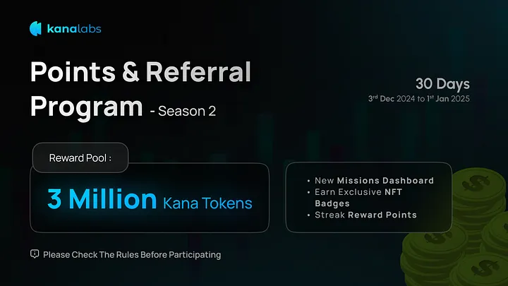
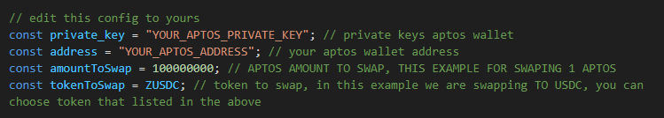

# Kana Labs Auto Swap Transactions to increase volume
- Read here about kannaLabs incentive [https://medium.com/kana-labs/](https://medium.com/kana-labs/kana-labs-presents-season-2-points-referrals-campaign-3cf0d3da60df)



- Read here about kannaLabs incentive [https://medium.com/kana-labs/](https://medium.com/kana-labs/kana-labs-presents-season-2-points-referrals-campaign-3cf0d3da60df)

## Features

- **Auto Transaction Swap using kanalabs provider**
- **Select token you want to swap** you can edit in `config.js`
- **This script create for increasing volume swap in kanalabs**
- **Register And Connect Aptos Wallet:** [https://app.kanalabs.io/points](https://app.kanalabs.io/points?address=0xa870f6d0cc04e6da4d697190db178a44bbc11b1eaf61246f7552e09e1ca212f4)

## Requirements

- **Node.js**: Ensure you have Node.js installed.
- **npm**: Ensure you have npm installed.
<h2 style="color:red;">it cost me about 3 Aptos gas fee to creating $50k volumes! <br>
So Make sure You Stop The script if you already reached target volume!</h2>

## Setup

1. Clone this repository:
   ```bash
   git clone https://github.com/Zlkcyber/kanalabs.git
   cd kanalabs
   ```
2. Install dependencies:
   ```bash
   npm install
   ```
3. Setup: edit config.js to your needs and input privkey and addr there
   ```bash
   nano config.js
   ```
    
4. Run The Script:
   ```bash
   npm run start
   ```

## 

This project is licensed under the [MIT License](LICENSE).
